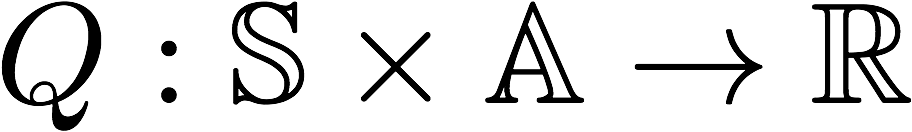

#### Udacity Deep Reinforcement Learning Nanodegree

### Project 1: Navigation 

##  Objective

In this project, I build a reinforcement learning (RL) agent that navigates an environment that has the purpose to collect as many yellow bananas as possible. We should also avoid blue bananas.  In order to solve the environment, our agent must achieve an average score of +13 over 100 consecutive episodes.

Reward distribution is as follows:

- Collect yellow banana : +1 score

- Collect blue banana : -1 score

  

The state space has 37 dimensions and contains the agent's velocity, along with ray-based perception of objects around agent's forward direction. Given this information, the agent has to learn how to best select actions. Four discrete actions are available, corresponding to:

- **`0`** - move forward.
- **`1`** - move backward.
- **`2`** - turn left.
- **`3`** - turn right.


### Getting Started

1. Download the environment from one of the links below. You need only select the environment that matches your operating system:

   - Linux: [click here](https://s3-us-west-1.amazonaws.com/udacity-drlnd/P1/Banana/Banana_Linux.zip)
   - Mac OSX: [click here](https://s3-us-west-1.amazonaws.com/udacity-drlnd/P1/Banana/Banana.app.zip)
   - Windows (32-bit): [click here](https://s3-us-west-1.amazonaws.com/udacity-drlnd/P1/Banana/Banana_Windows_x86.zip)
   - Windows (64-bit): [click here](https://s3-us-west-1.amazonaws.com/udacity-drlnd/P1/Banana/Banana_Windows_x86_64.zip)

   (*For Windows users*) Check out [this link](https://support.microsoft.com/en-us/help/827218/how-to-determine-whether-a-computer-is-running-a-32-bit-version-or-64) if you need help with determining if your computer is running a 32-bit version or 64-bit version of the Windows operating system.

   (*For AWS*) If you'd like to train the agent on AWS (and have not [enabled a virtual screen](https://github.com/Unity-Technologies/ml-agents/blob/master/docs/Training-on-Amazon-Web-Service.md)), then please use [this link](https://s3-us-west-1.amazonaws.com/udacity-drlnd/P1/Banana/Banana_Linux_NoVis.zip) to obtain the environment.

2. Place the file in the DRLND GitHub repository, in the `p1_navigation/` folder, and unzip (or decompress) the file.

## Workflow

Here are the high-level steps taken in building an agent that solves this environment.

1. Evaluate and get familiar the state and action space.
2. Establish baseline using a random action policy. (Imp)
3. Implement learning algorithm. (Imp)
4. Train the agent based on the method chosen and measure agent performance.
5. Test your agent in the environment.

###  Establish Baseline

Before building an agent that learns, I started by playing the agent that selects actions in equi-probable random manner.

```
env_info = env.reset(train_mode=True)[brain_name] # reset the environment
state = env_info.vector_observations[0]            # get the current state
score = 0  

for i in range(11):
    env_info = env.reset(train_mode=True)[brain_name] # reset the environment
    state = env_info.vector_observations[0]            # get the current state
    score = 0  

while True:
    action = np.random.randint(action_size)        # select an action
    env_info = env.step(action)[brain_name]        # send the action to the environment
    next_state = env_info.vector_observations[0]   # get the next state
    reward = env_info.rewards[0]                   # get the reward
    done = env_info.local_done[0]                  # see if episode has finished
    score += reward                                # update the score
    state = next_state                             # roll over the state to next time step
    if done:                                       # exit loop if episode finished
        break
print("Score_{}: {}".format(i+1,score))`
```

### Implement Learning Algorithm 

The algorithm used here is Q-learning which is implemented on neural networks as presented in the concept of Deep Q-Learning .

#### Q-Function

To discover an optimal policy, I setup a Q-function. The Q-function calculates the expected reward `R` for all possible actions `A` in all possible states `S`.



We can then define our optimal policy `π*` as the action that maximizes the Q-function for a given state across all possible states. The optimal Q-function `Q*(s,a)` maximizes the total expected reward for an agent starting in state `s` and choosing action `a`, then following the optimal policy for each subsequent state.


In order to discount returns at future time steps, the Q-function can be expanded to include the hyperparameter gamma `γ`.


#### Epsilon Greedy Algorithm

Here , we experience another challenge known as the **exploration vs. exploitation dilemma**. It determines how the agent should learn and get involved in the environment through actions.

I implemented an **𝛆-greedy algorithm**. This algorithm allows the agent to choose between a greedy and a random action. Hence, the agent "explores" by picking a random action with some probability epsilon `𝛜`. However, the agent continues to "exploit" its knowledge of the environment by choosing actions based on the policy with probability (1-𝛜). The 𝛆-greedy logic implemented as part of the `agent.act()` method [here](https://github.com/tommytracey/DeepRL-P1-Navigation/blob/master/agent.py#L66) in `agent.py` of the source code.

#### Deep Q-Network (DQN)

With Deep Q-Learning, a deep neural network is used to approximate the Q-function. Given a network `F`, finding an optimal policy is a matter of finding the best weights `w` such that `F(s,a,w) ≈ Q(s,a)`.

The neural network architecture used for this project can be found [here](https://github.com/tommytracey/DeepRL-P1-Navigation/blob/master/model.py#L5) in the `model.py` file of the source code. The network contains three fully connected layers with 64, 64, and 4 nodes respectively. 

#### Experience Replay

Experience replay allows the RL agent to learn from past experience. As for the network inputs, rather than feeding-in sequential batches of experience tuples, I randomly sample from a history of experiences using an approach called Experience Replay. This is done to break the correlation between sequential experiences present in consecutive episodes of agent.

Each experience is stored in a replay buffer as the agent interacts with the environment. The replay buffer contains a collection of experience tuples with the state, action, reward, and next state `(s, a, r, s')`. The agent then samples from this buffer as part of the learning step. Experiences are sampled randomly, so that the data is uncorrelated.

The implementation of the replay buffer can be found in the `agent.py` file of the source code.

### Future works

#### Double Deep Q-Network (DDQN)

One issue with Deep Q-Networks is they can overestimate Q-values (see [Thrun & Schwartz, 1993](https://www.ri.cmu.edu/pub_files/pub1/thrun_sebastian_1993_1/thrun_sebastian_1993_1.pdf)). The accuracy of the Q-values depends on which actions have been tried and which states have been explored. If the agent hasn't gathered enough experiences, the Q-function will end up selecting the maximum value from a noisy set of reward estimates. Early in the learning process, this can cause the algorithm to propagate incidentally high rewards that were obtained by chance (exploding Q-values). This could also result in fluctuating Q-values later in the process.

We can address this issue using Double Q-Learning, where one set of parameters `w` is used to select the best action, and another set of parameters `w'` is used to evaluate that action.

#### Dueling Agents

Dueling networks utilize two streams: one that estimates the state value function `V(s)`, and another that estimates the advantage for each action `A(s,a)`. These two values are then combined to obtain the desired Q-values.

The reasoning behind this approach is that state values don't change much across actions, so it makes sense to estimate them directly. However, we still want to measure the impact that individual actions have in each state, hence the need for the advantage function.

### Instructions

Follow the instructions in `Navigation_project.ipynb` to get started with training your own agent!