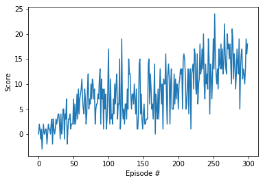

# Report

## Learning algorithm

Learning method used : Vanilla DQN + Replay Buffer. 

Input State : A vector consisting of 37 elements (hence, no need of CNNs. Neural networks will suffice the purpose.)

The deep neural network has following layers:

- Fully connected layer (fc1)- input: 37 (state size) output: 128
- Fully connected layer (fc2)- input: 128 output 64
- Fully connected layer (fc3)- input: 64 output: (action size)

Activation function used  :  ReLU function

Parameters used in DQN algorithm:

- Maximum steps per episode: 1000
- Starting epsilion: 1.0
- Ending epsilion: 0.01
- Epsilion decay rate: 0.98

## Results



```python
-> Episode 100	Average Score: 4.08
-> Episode 200	Average Score: 7.27
-> Episode 300	Average Score: 13.06

Good


Environment solved in 200 episodes!	Average Score: 13.06
```

## Future works

- Double DQNs : Tackles problem of over - estimation of action values
- Duelling DQNs : Introduces advantage values along with state values, focuses more on the actions taken from states
- Prioritzed Experience Replay Memory : Keeps rare episodes as valuable experiences and utilises to the advantage of the learning process.
- RAINBOW : Considers an ensemble of above mentioned methods and other methods too.
- To use and train directly from pixels,rather than using state information. 

## 